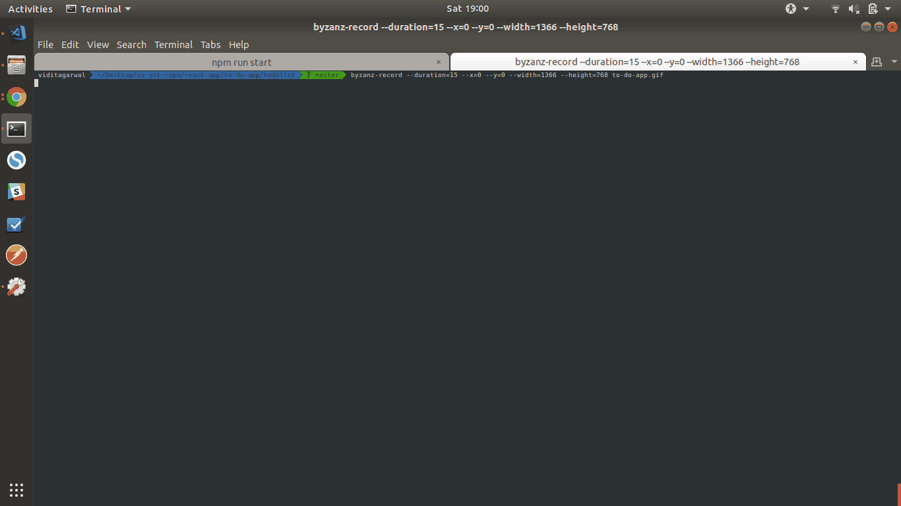

# TodoList App
This project was bootstrapped with [Create React App](https://github.com/facebook/create-react-app).

This App is the first in the series of small project that I will build during the learning process of the react. These mini projects will be fully functional. I will also deploy these on different platforms like the heroku or the netlify.

## Run locally
To run this app locally on the browser, type the following command: `npm run start`

Open the browser and type [localhost:3000](http://localhost:3000)

## Functionality
This is a very basic Todo App. User can create the todo tasks and on completion of the task can delete them from the list. As of now, they are not stored in the database but will implement this in future.

## Deployment
Following mini project has been deployed on Heroku. Follow are the steps:
    .
## Snapshots
